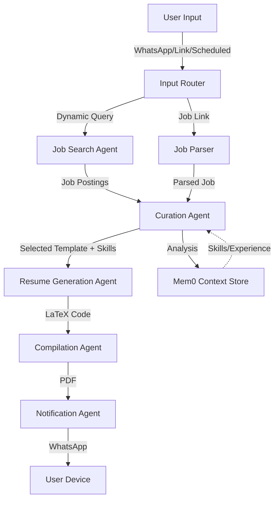
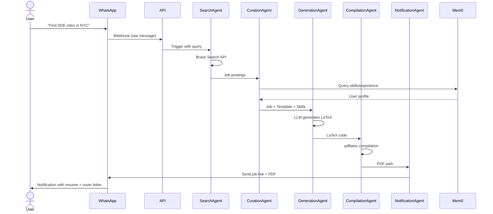

# Job Autopilot 🚀

An autonomous agentic AI system that scrapes job boards, curates your experience, and generates role-specific LaTeX resumes and cover letters compiled into PDFs—all delivered to WhatsApp.

## 🎯 Features

- **Multi-Source Job Input**: WhatsApp chat queries, direct LinkedIn links, or scheduled searches
- **Autonomous Agents**: LangGraph-powered agents orchestrate the entire workflow
- **Smart Curation**: Uses Mem0 to recall your skills and experiences
- **LaTeX Resume Generation**: Generates role-specific resumes as code
- **PDF Compilation**: Automatic LaTeX → PDF compilation with error self-correction
- **WhatsApp Delivery**: Job details and PDFs sent directly to your WhatsApp
- **Local LLM**: Runs Gemma-4-E2B-it via Ollama (fully local, no API calls needed)
- **Observable**: Integrated with LangSmith for workflow tracing

## 🏗️ Architecture



### System Components

| Component | Purpose | Technology |
|-----------|---------|-----------|
| **Job Search Agent** | Fetches 10-15 job postings | Brave Search MCP |
| **Curation Agent** | Analyzes jobs, pulls skills from Mem0, selects resume template | LangChain + Mem0 |
| **Resume Generation Agent** | Generates LaTeX resume tailored to job description | LLM (Gemma-4-E2B-it) |
| **Compilation Agent** | Compiles LaTeX to PDF with error recovery | pdflatex MCP Tool |
| **Cover Letter Agent** | Generates role-specific cover letter | LLM |
| **Notification Agent** | Delivers job info + PDFs to WhatsApp | Twilio/WhatsApp Business API |
| **LLM Provider** | Hosts local Gemma-4-E2B-it | Ollama |
| **Memory Store** | Maintains user skills, experience, preferences | Mem0 |

## 📊 Workflow Lifecycle



## 🚀 Input Modes

### 1. **WhatsApp Dynamic Queries** (Real-time)
```
User: "Find me backend engineer roles in San Francisco with Python"
→ Agent parses intent, searches jobs, generates tailored resume
→ Sends results + PDF within minutes
```

### 2. **Direct Job Link** (Ad-hoc)
```
User: Shares LinkedIn job post link via WhatsApp
→ Job Parser extracts description
→ Full workflow triggered
→ Resume + cover letter generated
```

### 3. **Scheduled Daily Search** (Automated)
```
Every day at 12:00 PM:
→ Hardcoded query from application config runs
→ Searches for "SDE roles in tech hubs"
→ User receives daily digest of top 5 matches
```

## 📦 Tech Stack

| Layer | Technology |
|-------|-----------|
| **Orchestration** | Python 3.11+, LangGraph, LangChain |
| **LLM** | Gemma-4-E2B-it (Ollama) |
| **Memory** | Mem0 |
| **Job Search** | Brave Search API |
| **PDF Generation** | LaTeX + pdflatex |
| **Messaging** | WhatsApp Business API / Twilio |
| **Observability** | LangSmith |
| **API Server** | FastAPI |
| **Database** | SQLite (local), PostgreSQL (production) |
| **Task Scheduling** | APScheduler |
| **Async Runtime** | asyncio |
| **Containerization** | Docker + Docker Compose |
| **LaTex Runtime** | TeX Live |

## 📁 Project Structure

```
job-autopilot/
├── backend/
│   ├── agents/                 # LangGraph agents
│   │   ├── search_agent.py
│   │   ├── curation_agent.py
│   │   ├── generation_agent.py
│   │   ├── compilation_agent.py
│   │   ├── notification_agent.py
│   │   └── orchestrator.py
│   ├── mcp_tools/              # MCP server implementations
│   │   ├── brave_search_mcp.py
│   │   ├── latex_compiler_mcp.py
│   │   └── whatsapp_notifier_mcp.py
│   ├── core/                   # Core utilities
│   │   ├── logger.py
│   │   ├── llm_provider.py
│   │   └── memory_manager.py
│   ├── models/                 # Pydantic schemas
│   │   ├── job.py
│   │   ├── resume.py
│   │   └── user.py
│   ├── api/                    # FastAPI routes
│   │   ├── whatsapp_webhook.py
│   │   ├── job_link_handler.py
│   │   ├── scheduled_trigger.py
│   │   └── status_endpoints.py
│   ├── config/                 # Configuration
│   │   ├── settings.py
│   │   └── templates/          # LaTeX templates (SWE, DevOps, ML)
│   ├── main.py                 # FastAPI app entry point
│   ├── requirements.txt
│   └── Dockerfile
├── frontend/                   # React/Next.js (UI for dashboard)
├── docker-compose.yml
├── .env.example
└── README.md
```

## ⚙️ Configuration

Create a `.env` file:

```bash
# LLM
OLLAMA_BASE_URL=http://localhost:11434
OLLAMA_MODEL=gemma2

# APIs
BRAVE_SEARCH_API_KEY=your_key_here
TWILIO_ACCOUNT_SID=your_sid_here
TWILIO_AUTH_TOKEN=your_token_here
TWILIO_WHATSAPP_NUMBER=+1234567890

# Mem0
MEM0_API_KEY=your_key_here

# LangSmith
LANGSMITH_API_KEY=your_key_here
LANGSMITH_PROJECT=job-autopilot

# Database
DATABASE_URL=sqlite:///./job_autopilot.db

# Scheduler
SCHEDULED_SEARCH_TIME=12:00
SCHEDULED_SEARCH_QUERY=SDE roles in major tech hubs
```

## 🔧 Quick Start

### Prerequisites
- Python 3.11+
- Docker & Docker Compose
- Ollama with Gemma-4-E2B-it model

### 1. Clone & Install

```bash
git clone https://github.com/krishnagajera45/Job-Auto-pilot.git
cd Job-Auto-pilot
pip install -r backend/requirements.txt
```

### 2. Start Services

```bash
# Terminal 1: Start Ollama (if not already running)
ollama serve

# Terminal 2: Start database migrations
cd backend
alembic upgrade head

# Terminal 3: Start FastAPI server
python main.py
```

### 3. Configure WhatsApp Webhook

```bash
# Update your WhatsApp webhook URL in Twilio Console:
https://your-domain.com/api/whatsapp/webhook
```

### 4. Test Locally

```bash
# Test WhatsApp query
curl -X POST http://localhost:8000/api/whatsapp/webhook \
  -H "Content-Type: application/json" \
  -d '{"From": "whatsapp:+1234567890", "Body": "Find SDE roles"}'

# Test job link
curl -X POST http://localhost:8000/api/job-link \
  -H "Content-Type: application/json" \
  -d '{"job_link": "https://linkedin.com/jobs/123456"}'

# Trigger scheduled search manually
curl -X POST http://localhost:8000/api/trigger-search
```

## 📖 API Endpoints

| Endpoint | Method | Purpose |
|----------|--------|---------|
| `/api/whatsapp/webhook` | POST | Receive WhatsApp messages |
| `/api/job-link` | POST | Submit job link manually |
| `/api/trigger-search` | POST | Manually trigger scheduled search |
| `/api/status/<job_id>` | GET | Get generation status |
| `/api/resumes` | GET | List generated resumes |
| `/api/preferences` | POST/GET | Manage user preferences |

## 🔍 Agent Details

### Job Search Agent
- Queries Brave Search with user intent
- Parses job title, company, description, location, salary
- Returns structured job data
- Handles pagination for multiple results

### Curation Agent
- Analyzes job requirements vs user skills
- Queries Mem0 for relevant experience
- Selects best LaTeX template (SWE/DevOps/ML)
- Ranks relevance score for job match
- Extracts key requirements to highlight

### Resume Generation Agent
- Takes job data + user profile + template
- Generates role-specific LaTeX with:
  - Tailored summary
  - Highlighted relevant experiences
  - Key skills matching job description
  - ATS-optimized formatting
- Strict prompt enforcement: No markdown, pure LaTeX

### Compilation Agent
- Compiles LaTeX to PDF
- Error handling with LLM self-correction loop:
  - If pdflatex fails → Extract error
  - Send error to LLM → Get fixed LaTeX
  - Retry compilation
  - Max 3 attempts
- Returns PDF path or error

### Notification Agent
- Formats job summary
- Uploads PDF to cloud storage (or embeds)
- Sends WhatsApp message with job link + PDF

## 🛡️ Error Handling

### LaTeX Compilation Errors
```python
# Self-correction loop
for attempt in range(3):
    try:
        pdf = compile_latex(tex_code)
        return pdf
    except LaTeXError as e:
        # LLM analyzes error and fixes LaTeX
        tex_code = await llm.invoke(f"Fix this LaTeX error: {e}")
```

### Network/API Failures
- Exponential backoff retry (3 attempts)
- Dead-letter queue for failed jobs
- Admin notification for critical failures

### LLM Hallucinations
- Prompt validation against schema
- Output parsing with fallback to template
- Manual override via admin dashboard

## 📊 Monitoring & Observability

All workflows are traced in LangSmith:
- Agent decisions and outputs
- MCP tool calls and responses
- Error traces
- Performance metrics (latency per agent)

Access traces: [LangSmith Console](https://smith.langchain.com)

## 🧠 Mem0 Integration

Mem0 stores:
- **User Profile**: Skills, experience, past roles
- **Preferences**: Preferred roles, companies, locations
- **Generated Resumes**: Previous versions for context
- **Application History**: Jobs applied to, outcomes

Query example:
```python
from mem0 import Memory

memory = Memory.from_config(config)
user_profile = await memory.search("My 5 years of backend experience with Python")
```

## 🚢 Deployment

### Docker Compose (Local Dev)
```bash
docker-compose up
# Services: Ollama, PostgreSQL, FastAPI, Redis
```

### Production (Docker)
```bash
# Build image
docker build -t job-autopilot:latest -f backend/Dockerfile .

# Run with environment vars
docker run --env-file .env \
  -p 8000:8000 \
  -v /latex-output:/app/output \
  job-autopilot:latest
```

### Kubernetes (Scaling)
- HPA based on job queue depth
- StatefulSet for database
- ConfigMap for templates
- Secrets for API keys

## 🤝 Contributing

1. Fork the repo
2. Create feature branch: `git checkout -b feat/your-feature`
3. Commit with conventional commits
4. Push and create PR

## 📝 Roadmap

- [ ] v1.0: Core agents + WhatsApp integration
- [ ] v1.1: Scheduled searches + Mem0 integration
- [ ] v1.2: React dashboard for resume preview
- [ ] v1.3: Multi-language resume generation
- [ ] v1.4: LinkedIn auto-apply integration
- [ ] v2.0: Email outreach automation
- [ ] v2.1: Negotiation coaching agent

## 📄 License

MIT License - see LICENSE file

## 💬 Questions?

- Open an issue on GitHub
- Join our Discord community
- Email: krishnagajera45@gmail.com

---

Built with ❤️ using LangGraph, Ollama, and a lot of ☕