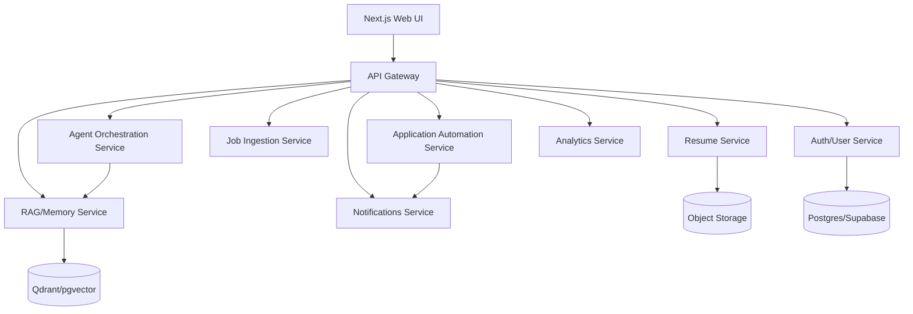

# Architecture

## Microservices Overview

## Tech Stack
- **APIs:** FastAPI
- **UI:** Next.js + Tailwind
- **Agent Orchestration:** LangGraph/LangChain, LangFlow
- **Tooling:** MCP/FastMCP
- **Memory:** Mem0
- **Model Serving:** vLLM / Ollama
- **Datastores:** Supabase/Postgres, Qdrant/pgvector, Redis
- **Queues:** RabbitMQ
- **Storage:** S3-compatible (MinIO)
- **Observability:** OpenTelemetry, Sentry, Prometheus-compatible metrics
- **Automation:** Playwright for ATS workflows
